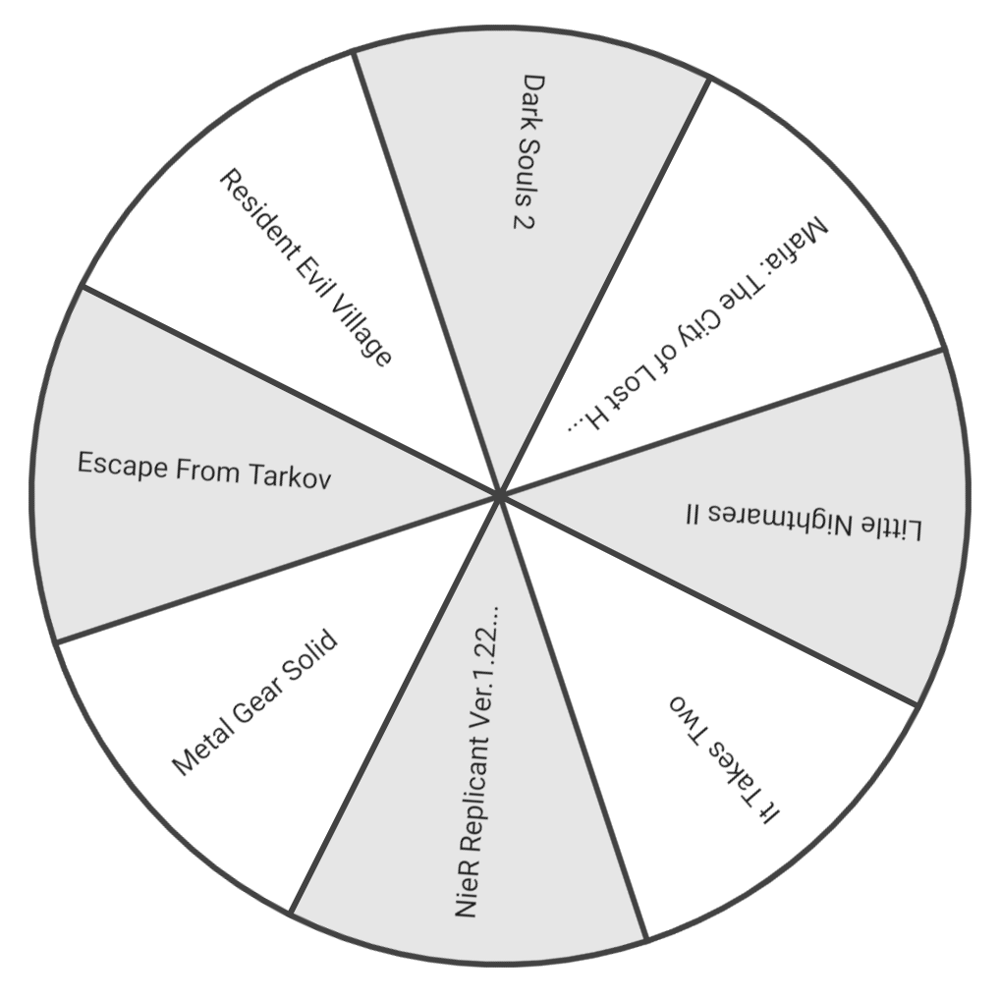

# React Spinning Wheel Canvas



## Features

- Written in TypeScript
- High DPI screens support
- SSR support
- Customizable timing function

## Installation

```bash
npm i react-spinning-canvas-wheel

yarn add react-spinning-canvas-wheel
```

## Usage

```tsx
import SpinningWheel, { SpinningWheelRef } from "react-spinning-wheel";

const Wheel = () => {
  const spinningWheelRef = useRef<SpinningWheelRef>();

  return (
    <div>
      {/* startSpinning(secondsToSpin: number, speed: number) */}
      <button onClick={() => spinningWheelRef.current.startSpinning(30, 4)}>
        Start
      </button>
      <button onClick={() => spinningWheelRef.current.stopSpinning()}>
        Stop
      </button>
      <SpinningWheel
        size={640}
        segments={segments}
        spinningWheelRef={spinningWheelRef}
        onSegmentChange={(index) => console.log("currentSegmentIndex:", index)}
        onSpinStart={() => console.log("started")}
        onSpinEnd={(winnerIndex) => console.log("winnerIndex:", winnerIndex)}
      />
    </div>
  );
};
```
